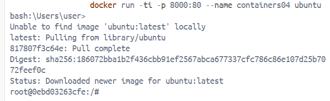
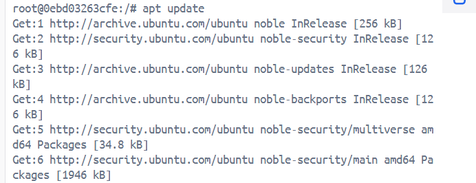
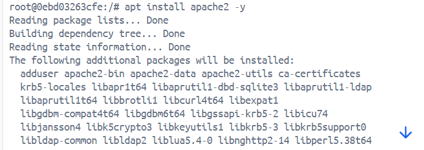
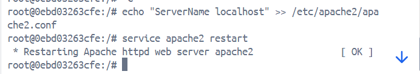
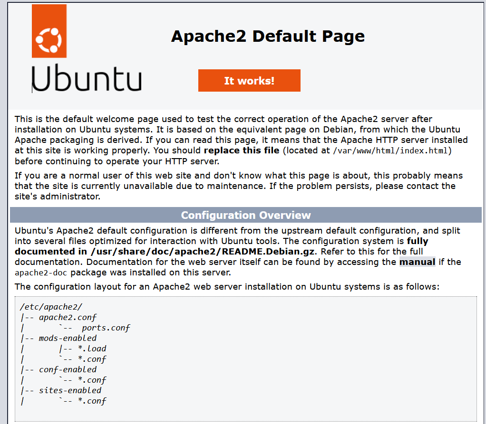
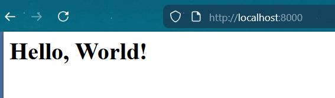

## IWNO4: Использование контейнеров как среды выполнения

### Цель работы
Данная лабораторная работа призвана напомнить основные команды ОС Debian/Ubuntu. Также она позволит познакомиться с Docker и его основными командами.

### Задание
Запустить контейнер Ubuntu, установить Web-сервер Apache и вывести в браузере страницу с текстом "Hello, World!".

#### **Шаг 1**
Перед выполнением работы, создаю репозиторий и клонирую себе на компьютер.

Выполняю первую команду для создания и запуска контейнера: 

```bash
docker run -ti -p 8000:80 --name containers04 ubuntu bash
```


#### **Шаг 2**
Поочередно выполняю следующие команды: 

```bash
apt update
```


```bash
apt install apache2 -y
```


```bash
service apache2 start
```


Открываю браузер и вижу стандартную страницу Apache.



#### Шаг 4

Выполняю следующие команды: 
```bash
ls -l /var/www/html/
echo '<h1>Hello, World!</h1>' > /var/www/html/index.html
```
Обновляя страницу, вижу заголовок "Hello, World!"



//ДОБАВИТЬ ЕЩЕ 

#### Шаг 5

Закрываю терминал, просматриваю список всех контейнеров командой `docker ps -a` и удаляем контейнер `docker rm containers04`

