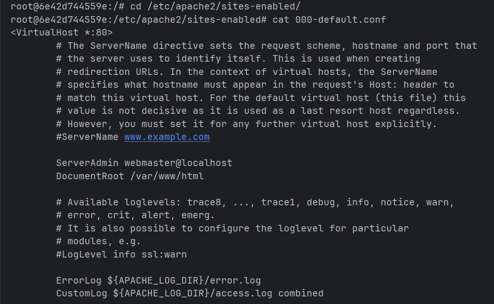

## IWNO4: Использование контейнеров как среды выполнения

### Цель работы
Данная лабораторная работа призвана напомнить основные команды ОС Debian/Ubuntu. Также она позволит познакомиться с Docker и его основными командами.

### Задание
Запустить контейнер Ubuntu, установить Web-сервер Apache и вывести в браузере страницу с текстом "Hello, World!".

#### **Шаг 1**
Перед выполнением работы, создаю репозиторий и клонирую себе на компьютер.

Выполняю первую команду для создания и запуска контейнера: 

```bash
docker run -ti -p 8000:80 --name containers04 ubuntu bash
```


#### **Шаг 2**
Поочередно выполняю следующие команды: 

```bash
apt update
```


```bash
apt install apache2 -y
```


```bash
service apache2 start
```


**1. `apt update`**
Обновляет список доступных пакетов из репозиториев.
Не устанавливает ничего - просто синхронизирует информацию о версиях.

**2. `apt install apache2 -y`**
Устанавливает веб-сервер Apache2.
Флаг `-y` автоматически отвечает "да" на все вопросы при установке.

**3. `service apache2 start`**
Запускает веб-сервер Apache2.
После этой команды сервер начинает слушать порт 80 и обрабатывать HTTP-запросы.

Открываю браузер и вижу стандартную страницу Apache.


#### Шаг 4

Выполняю следующие команды: 
```bash
ls -l /var/www/html/
echo '<h1>Hello, World!</h1>' > /var/www/html/index.html
```
В результате создаётся файл `index.html` в папке веб-сервера с содержимым `<h1>Hello, World!</h1>`.
`>` - перенаправляет вывод команды в ранее созданный файл.
После этого страница будет доступна в браузере по адресу `http://localhost/`.

Убеждаюсь в этом обновляя страницу, вижу заголовок "Hello, World!"


Далее выполняю следующие команды: 

```dockerfile
cd /etc/apache2/sites-enabled/
```
Переходим в папку с активными (включёнными) сайтами Apache2.
Здесь хранятся символические ссылки на конфиги из папки `sites-available/`.

```dockerfile
cat 000-default.conf
```
В терминал выводится содержимое файла конфигурации сайта по умолчанию `000-default.conf`.
В нём указаны настройки виртуального хоста: порт (80), корневая папка сайта (`/var/www/html`), логи и т.д.



#### Шаг 5

Закрываю терминал, просматриваю список всех контейнеров командой `docker ps -a` и удаляем контейнер `docker rm containers04`

